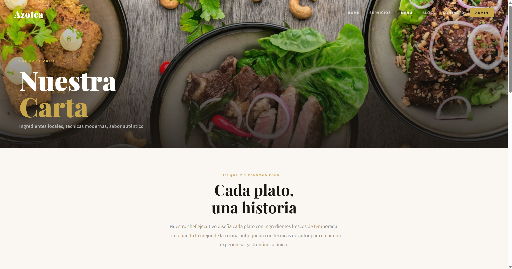
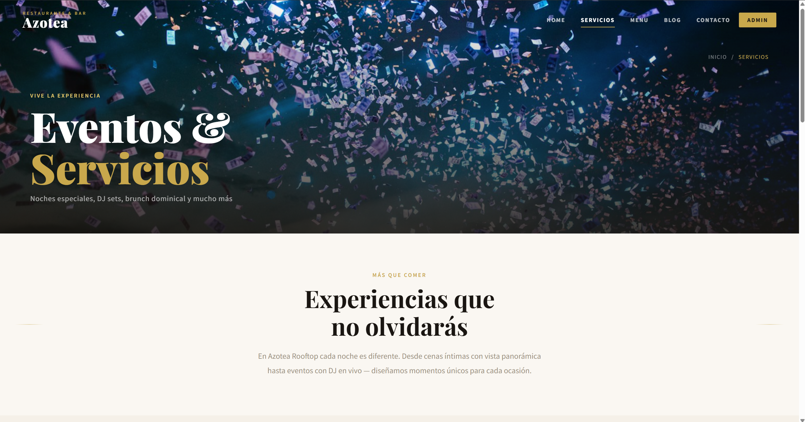
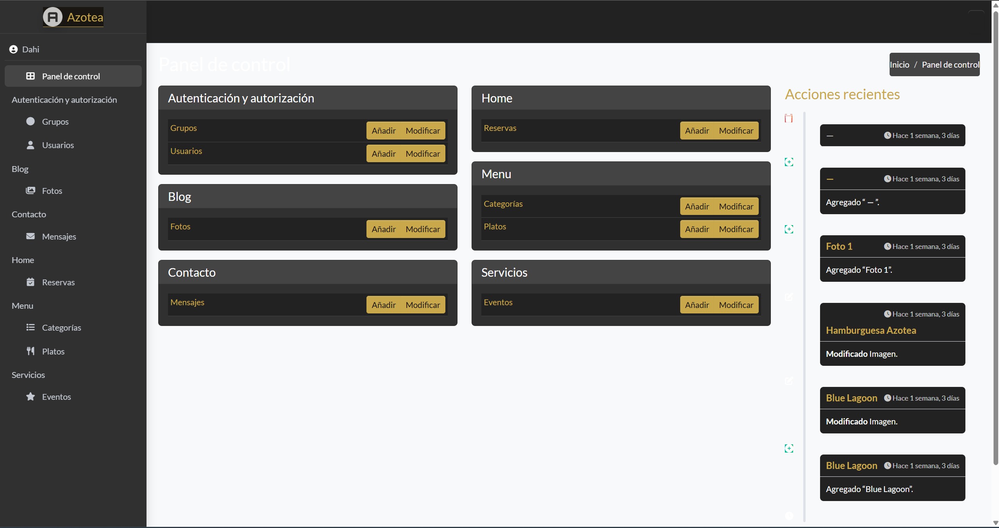

# 🍽️ Azotea Rooftop

Aplicativo web para la gestión de reservas y visualización del menú del restaurante Azotea Rooftop, ubicado en Medellín, Colombia.

## 🛠️ Tecnologías utilizadas
- Python 3
- Django
- HTML / CSS / Bootstrap
- JavaScript
- SQLite3

## ✨ Funcionalidades
- Visualización de menú con filtros por categoría
- Formulario de reservas de mesa
- Galería de fotos categorizada por Ambiente, Platos y Eventos
- Sección de eventos y servicios disponibles
- Formulario de contacto
- Panel de administración para gestión del restaurante

## 📸 Capturas de pantalla

### Página de inicio


### Menú


### Servicios


### Panel de administración


## 👩‍💻 Desarrollado por
- [Dahiana Gaviria](https://github.com/DahianaGL)
- [Deiber Bedoya](https://github.com/DeiberBedoya)

## 🚀 Cómo ejecutar el proyecto localmente

```bash
# 1. Clonar el repositorio
git clone https://github.com/DahianaGL/Azotea.git

# 2. Crear y activar el entorno virtual
python -m venv venv
source venv/Scripts/activate  # Windows

# 3. Instalar dependencias
pip install -r requirements.txt

# 4. Ejecutar migraciones
python manage.py migrate

# 5. Iniciar el servidor
python manage.py runserver
```

## 📁 Estructura del proyecto
```
Azotea/
├── azotea/        # Configuración principal
├── Blog/          # App de galería de fotos
├── Contacto/      # App de mensajes
├── Home/          # App de reservas
├── Menu/          # App de platos y categorías
├── Servicios/     # App de eventos
├── static/        # Archivos CSS y JS
├── media/         # Imágenes subidas
└── manage.py
```
